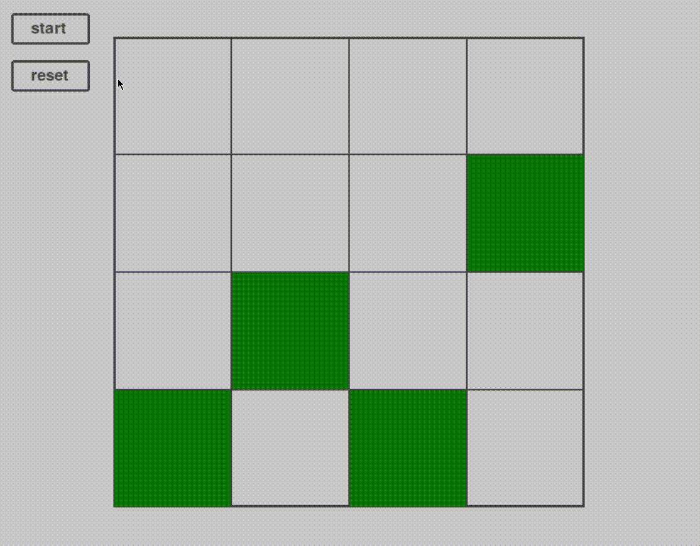
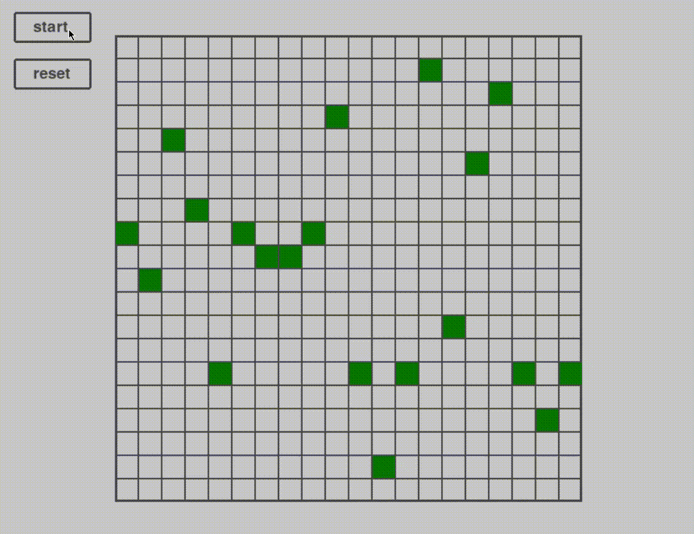

# N-Queens

## Introduction
The N-Queens is a **Constraint Satisfaction Problem** (CSP) where the task is to place a total of N queens on a chess board of NxN size, such that no pair of queens share the same row, column, diagonal or anti-diagonal placement. I have encountered this problem during my Artificial Intelligence course at UniMi, and I was intrigued by a very specific resolution: the Min-Conflicts algorithm.

## Mathematical formalization
A Constraint Satisfaction Problem can be formalized through a set of variables $X_i$ that require to be assigned a value selected by their domain of values $D_i$, and a set of constraints to satisfy. It is solved through an algorithm that assigns values to each variable without breaking the given constraints. Applying this definition to our problem, we have a grid where each cell in position i,j is a variable $X_{ij}$. Each variable can have a value of 1 if there is a queen in the cell, or 0 otherwise. The resulting assignment to each cell must respect the following constraints:
- $ ∀i,j,k ⟨(X_{ij},X_{ik})⟩ [(0,0), (0,1), (1,0)] $ → at most one queen per row
- $ ∀i,j,k ⟨(X_{ji},X_{ki})⟩ [(0,0), (0,1), (1,0)] $ → at most one queen per column
- $ ∀i,j,k ⟨(X_{ij},X_{i+k,j+k})⟩ [(0,0), (0,1), (1,0)] $ → at most one queen per diagonal 
- $ ∀i,j,k ⟨(X_{ij},X_{i+k,j−k})⟩ [(0,0), (0,1), (1,0)] $ → at most one queen per anti-diagonal
- $ \langle (X_{11},X_{12}, ...,X_{NN}), [S_N] \rangle, \quad S_N = \{(x_{11}, x_{12}, ..., x_{NN}) \in \{0,1\}^{N^2} \mid \sum_{i=1}^{N} \sum_{j=1}^{N} x_{ij} = N \} $ → very long way to say exactly n queens in the board

## Enough math, what's this repo about?
I have seen 2 main solutions for CSPs, Backtracking Search and **Min-Conflicts**. I was very intrigued by the fact that the Min-Conflicts algorithm is, in theory, not a great solution, as it does not guarantee to find a solution, but apparently it is a very solid approach for problems with a lot of variables. And so I though, why not see for myself? That is what this python project is about, seeing with my own eyes what this algorithm manages to do. Here is the pseudocode:
```
Min-Conflicts(n, max_steps):
|-- Initialize empty nxn board
|-- Place the n queens on the board, one per column at a random height
|-- For i <= max_steps:
|   |-- if goal_check then return board
|   |-- queen <- select a random queen that is in the incorrect place
|   |-- Place the queen in the cell that minimizes conflicts with constraints
|-- return fail
```
I implemented this in **python**, through a 2 dimensional list for the board and a list of Vector2 for the queens, containing the position as x-column and y-row.
To visualize the algorithm step-by-step, I used **pygame**: I was not familiar with it, so it can definitely be improved, but it does the job. The result is something like this:




You may change the speed at which the moves are made by changing the `time.sleep()` parameter in the `min-conflicts()` function.

