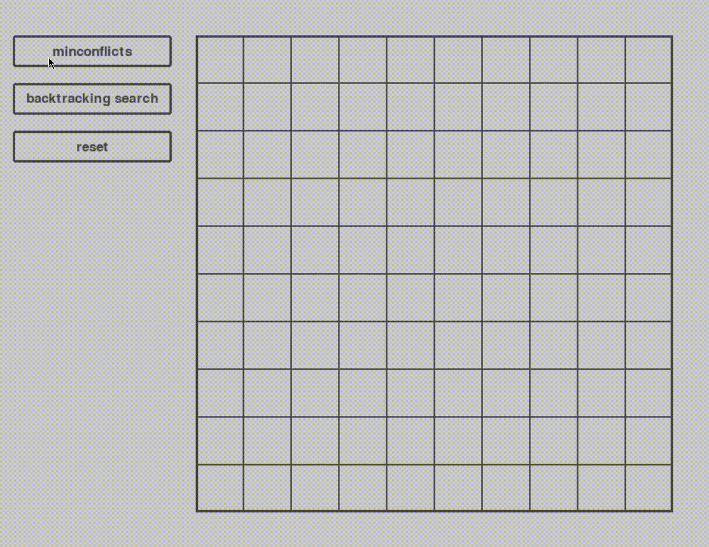

# N-Queens resolution, visualized

## Introduction
The N-Queens problem is a **Constraint Satisfaction Problem** (CSP), where the task is 
to place a total of N queens on a chess board of NxN size, such that no pair of 
queens share the same row, column, diagonal or anti-diagonal placement. \
I have encountered this problem during my Artificial Intelligence course at UniMi, 
and I was intrigued by a very specific resolution: the Min-Conflicts algorithm.

## The Min-Conflicts algorithm
The Min-Conflicts algorithm is more of a **heuristic method** of resolution for CSPs.
The core idea is that by assigning a random value to every variable of the problem,
you may solve the problem quickly by reassigning a different value to one of the 
variables that contains a constraint-violating value. More specifically, the value 
that minimizes the amount of conflicts with the other values.

## So why was it so interesting?
This technique peaked my interest when we analyzed **its performance on large-scale
CSPs**. Especially the 1,000,000 Queens problem, that is proven to be solved very 
rapidly by this approach, whereas other techniques may be slower. \
For this exact reason, I have implemented not only the Min-Conflicts algorithm,
but also a backtracking search algorithm. Indeed, by running the two one after 
the other on equally sized boards, the Min-Conflicts algorithm seems to have an
easier time solving this problem.

## Implementation
I have implemented this whole project through python, with the pygame library 
for visualization. It can be made much faster, though I haven't made the time to 
do it since this was just a hobby project to satisfy my interest and practice 
this language.

## Visualization
For those who don't have time to download and run the code (how can I blame you?),
here is a little gif to show the current result of the project on a 10x10 board.

For those who have downloaded the project to test it out, you may change the speed 
at which each step is made by changing the `delay` variable in the `utils.py` file. \
In that same file, there are all the variables you may want to play with to change
the visualization.

